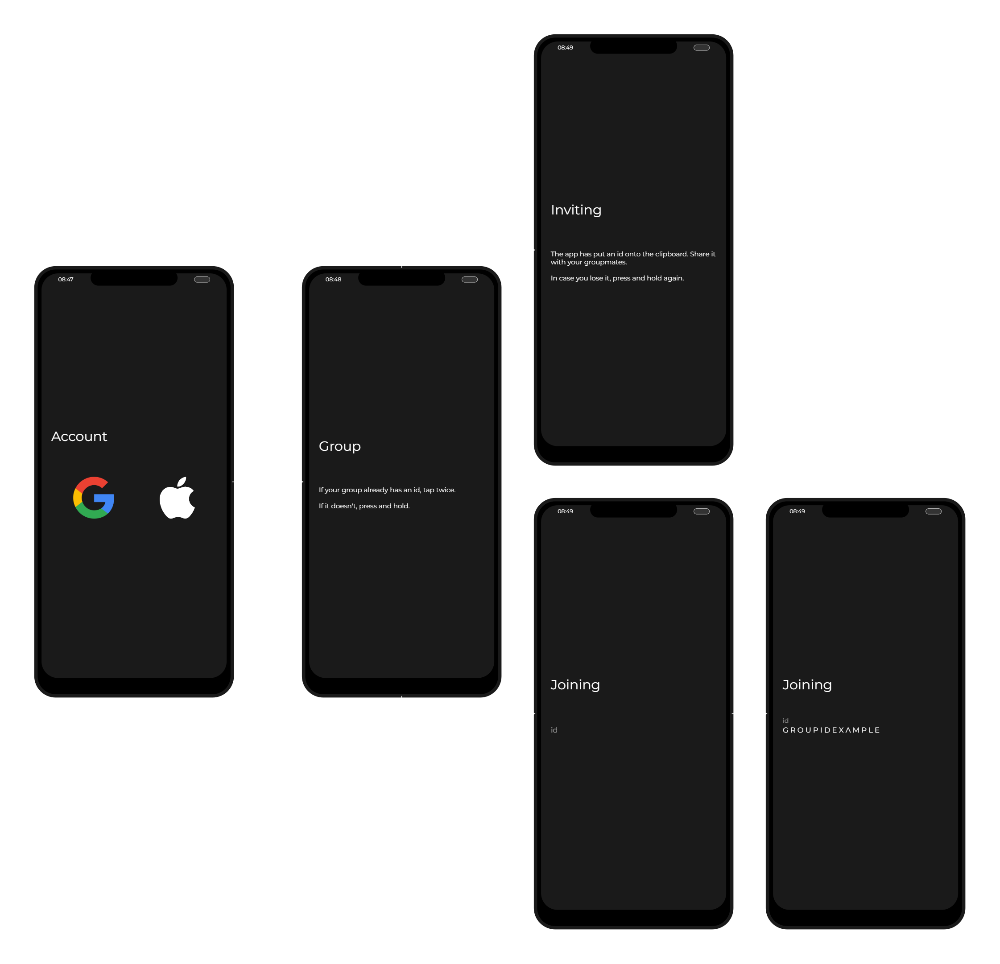
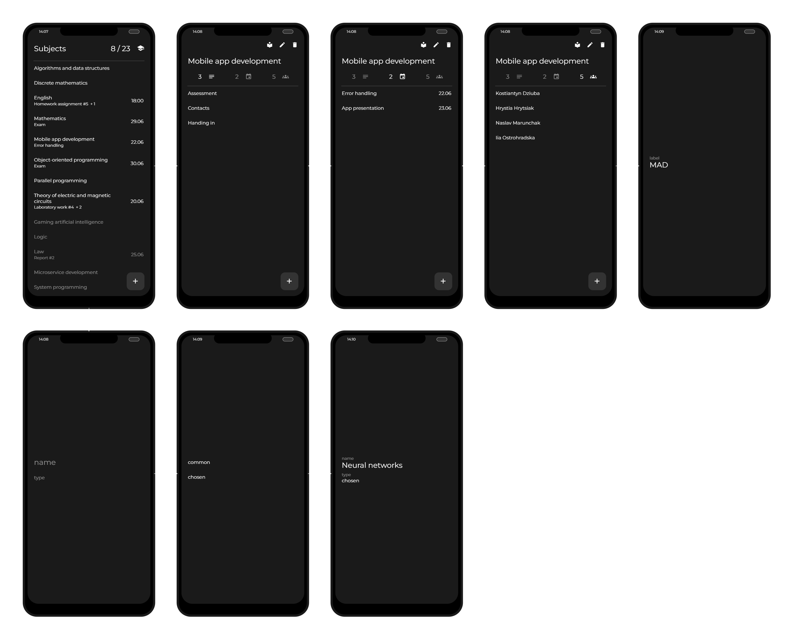
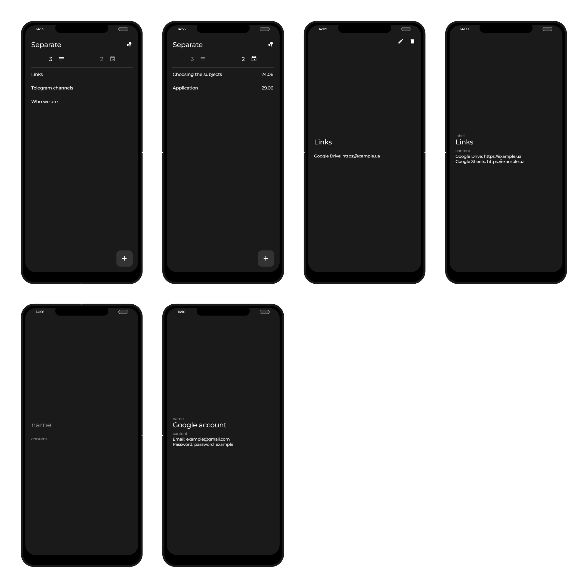
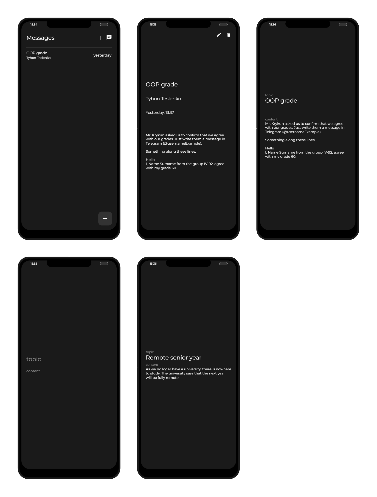

# Подійни́к | Podiinyk

A minimalistic cross-platform mobile app for Ukrainian students.

The idea is to make it easy to track what's going on, store information,
move important studying-related messages out of chatting apps, where they are lost.

The tech stack is [Flutter](https://flutter.dev) + [Firebase](https://firebase.google.com).

## How it works

A student from a group has heard about the app and decided to try it out. 
They install it and sign up with Google or Apple. The app creates a new group id, 
and the student shares it with their groupmates, who are now able to join the group with it.

The students now use the app as a group. Anything added by one is visible to all.

## Sections

### Events

An event is anything that's tied to a specific point in time. It can belong to a subject 
(like a lab deadline or a test), or be a separate event (like choosing the subjects for the next term). 
It also features an optional note, in case there is something to add.

### Subjects

A subject can either be common (required to be studied by all students) or chosen 
(only studied by some). Info can be added to it (like the curriculum or the teacher's contact info). 
Its page has subsections for the info, the events, the students (unless it's common).

### Separate

This section is for separate info and events. Like with events, it's possible for 
info not to belong to a subject (like the info about the group sometimes required in documents, 
or links to the group's files).

### Messages

A message can be a reminder, or a way for a student to share something with the rest of the group. 
For example, when russia turns the university into rubble and it makes a statement 
about how the studying process shall change.

### Groupmates

The group's students, excluding the user. The page of a student contains their info, 
if they've added any, and the chosen subjects, if there are any.

### Me

The section where the user can change the name, the info on their page, the language. 
Switching the group, signing out and deleting the account are also available from here. 
Customizing the theme will be too... some day.

